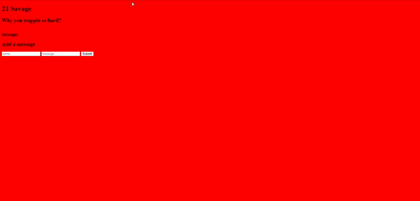

# 21 Savage Fan Site 

Welcome to the 21 Savage Fan site! A message board site for fans of 21 savage. 21, 21, 21, 21!

## How It's Made

**Tech used:** HTML, CSS, EJS, Node.js, Bootstrap, JavaScript

I built this application using a combination of HTML, CSS, and JavaScript for the front end. The dynamic content and interactivity were achieved with EJS and Node.js on the server side. Bootstrap was utilized to enhance the overall design and responsiveness of the site.

In the process of development, I focused on creating a seamless user experience. Originally, the message board displayed separate counts for thumbs up and thumbs down. However, through optimization, I consolidated the counts into a single number, simplifying the user interface.

## Optimizations

Additionally, I implemented a sorting feature on the message board, arranging messages based on the number of likes they received. This enhancement allows users to easily discover the most popular messages and engage with the content that resonates the most with the community.

## Lessons Learned

Throughout the development of this 21 Savage Fan site, I encountered various challenges and breakthroughs. One key lesson learned was the importance of refining the user interface for simplicity and efficiency. The consolidation of thumbs up and thumbs down counts and the introduction of sorting based on likes demonstrate my commitment to improving the overall user experience.

## Installation

1. Clone repo
2. run `npm install`

## Usage

1. run `npm run savage`
2. Navigate to `localhost:4000`

